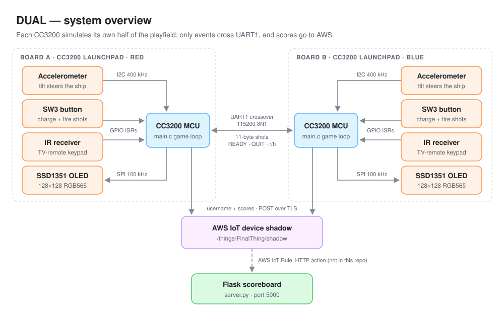
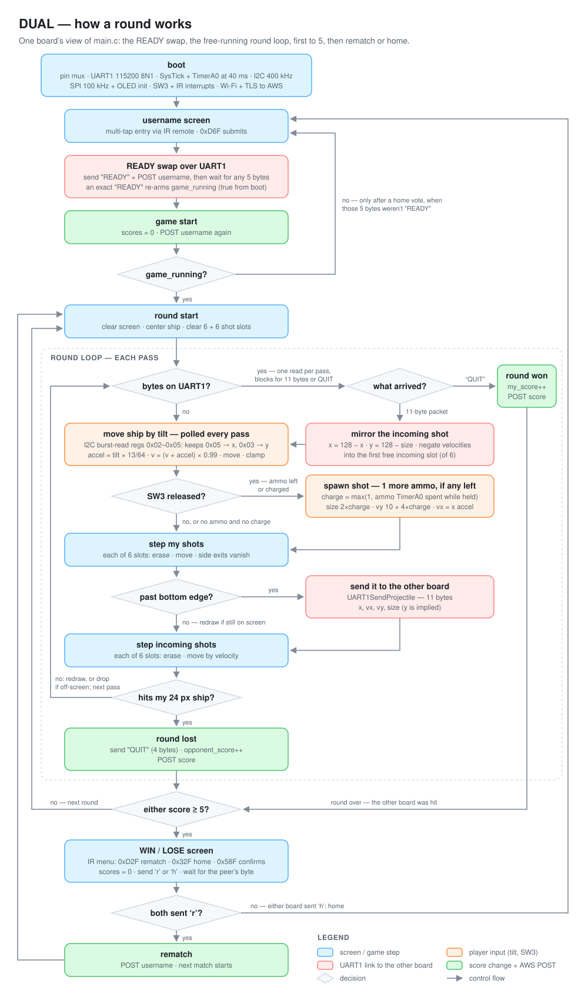
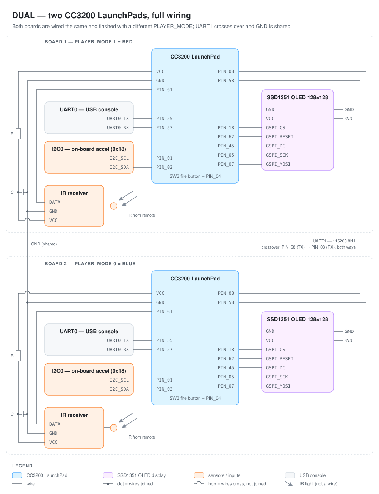

# DUAL — a two-board CC3200 arcade shooter

<p align="center"></p>

A real-time two-player game inspired by the mobile game *DUAL*, built on **two TI CC3200 LaunchPads**, each driving its own **Adafruit SSD1351 128×128 OLED** over SPI. You steer your ship by **tilting the board** (the LaunchPad's on-board accelerometer, read over I2C), charge and fire shots with **SW3**, and your projectiles fly off the bottom of your screen and **onto your opponent's screen** through an 11-byte packet on a **UART crossover cable**. Usernames are typed with a **TV-remote multi-tap keypad**, decoded from raw IR pulse widths in a GPIO interrupt handler. Every round result is POSTed over TLS to an **AWS IoT device shadow**, and a small **Flask server** ([server.py](server.py)) keeps a live two-player scoreboard fed from the cloud.

The interesting part isn't any single peripheral — it's that **there is no shared game state**. Each board simulates only its own half of the world: its ship, its shots, its ammo. The moment a projectile leaves the bottom edge, it is serialized, sent, and *reconstructed* on the peer with mirrored coordinates and negated velocities — the two screens behave like one continuous playfield folded in half. Synchronization is purely event-based: a `READY` handshake to start, a `QUIT` message when a ship is hit, a one-byte `r`/`h` vote on the rematch screen. No clocks are exchanged, ever.

Demo & writeup: **[project webpage](https://dihan922.github.io/dual-webpage/)** (built with teammate [dihan922](https://github.com/dihan922)).

---

## Table of Contents

1. [How a Round Works](#how-a-round-works)
2. [The Hardware](#the-hardware)
3. [Repository Map](#repository-map)
4. [The Display Path](#the-display-path)
5. [Tilt Control — the I2C Accelerometer](#tilt-control--the-i2c-accelerometer)
6. [Fire Control — Charge, Ammo, Cooldown](#fire-control--charge-ammo-cooldown)
7. [The IR Username Keypad](#the-ir-username-keypad)
8. [The UART1 Board Link](#the-uart1-board-link)
9. [The Cloud Scoreboard](#the-cloud-scoreboard)
10. [Build & Flash](#build--flash)
11. [Known Limitations & Sharp Edges](#known-limitations--sharp-edges)
12. [Provenance & Acknowledgments](#provenance--acknowledgments)

---

## How a Round Works

<p align="center"></p>

One board's projectile becomes the other board's incoming projectile: the sender only ever simulates shots moving *down* its own screen, and the receiver only ever simulates them moving *up* — the mirroring in `UART1ReceiveProjectile` is what folds the two screens into one playfield.

## The Hardware



Every pin below is verified against [pin_mux_config.c](pin_mux_config.c) (generated by TI PinMux 4.0.1543), [main.c](main.c) and [Adafruit_OLED.c](Adafruit_OLED.c):

| Net | CC3200 pin | Role |
|---|---|---|
| I2C SCL / SDA | PIN_01 / PIN_02 | on-board accelerometer, address `0x18`, 400 kHz fast mode |
| GSPI CLK / MOSI | PIN_05 / PIN_07 | OLED data, 100 kHz, SPI mode 0 |
| GSPI MISO | PIN_06 | muxed but unused — the SSD1351 is write-only here |
| OLED CS | PIN_18 (GPIO28) | driven manually per byte (hardware CS on PIN_50 is *also* toggled) |
| OLED RESET | PIN_62 (GPIO7) | configured as output — but never pulsed (see [sharp edges](#known-limitations--sharp-edges)) |
| OLED DC | PIN_45 (GPIO31) | command/data select |
| UART1 TX / RX | PIN_58 / PIN_08 | board-to-board crossover link, 115200 8N1 |
| UART0 TX / RX | PIN_55 / PIN_57 | USB debug console (`Report` printf) |
| IR data | PIN_61 (GPIO6) | IR receiver output, both-edge interrupts |
| SW3 | PIN_04 (GPIO13) | fire button (on-board switch) |

Crossover wiring between the boards: board A TX → board B RX, board A RX → board B TX, and the grounds **must** be tied together — it's a 3.3 V TTL link with no level shifting.

## Repository Map

```text
dual-main/
├── README.md               # you are here
├── SYSTEM-DESIGN.md        # the architecture-level view
├── docs/                   # SVG diagrams (light and dark aware)
│   ├── system-overview.svg         # README: overview at the top
│   ├── how-a-round-works.svg       # README: how a round works
│   ├── wiring-diagram.svg          # README: the two-board schematic
│   ├── system-design-flowchart.svg # SYSTEM-DESIGN: end-to-end flowchart
│   ├── system-design-round.svg     # SYSTEM-DESIGN: deep dive 1, one round
│   └── packet-and-fold.svg         # SYSTEM-DESIGN: deep dive 2, packet + fold
├── main.c                  # the whole game: ISRs, game loop, UART link protocol,
│                           #   IR decoding, multi-tap keypad, AWS shadow POSTs
├── pin_mux_config.c/.h     # TI PinMux-generated pin assignments
├── Adafruit_OLED.c         # SSD1351 driver ported to CC3200 SPI: init sequence,
│                           #   per-byte writeCommand/writeData, HW-window fills
├── Adafruit_SSD1351.h      # SSD1351 command set + 128×128 dimensions
├── Adafruit_GFX.c/.h       # Adafruit GFX primitives ported from C++ to C
├── glcdfont.h              # classic 5×7 ASCII font table
├── i2c_if.c                # TI SDK polled I2C master helpers (reference copy only —
│                           #   .project links the SDK's own i2c_if.c, and that is what builds)
├── server.py               # Flask scoreboard receiver (AWS IoT Rule HTTP action posts here)
├── cc3200v1p32.cmd         # TI linker script for the CC3200
├── .project / .cproject    # CCS project — links uart_if.c / gpio_if.c /
│                           #   i2c_if.c / startup_ccs.c from the CC3200 SDK by path
├── targetConfigs/          # CCS debug target (Stellaris ICDI → CC3200)
└── .launches/              # CCS launch config for the "lab-final" build
```

## The Display Path

[Adafruit_OLED.c](Adafruit_OLED.c) is a C port of Adafruit's SSD1351 driver riding on the CC3200's GSPI at **100 kHz, SPI mode 0, 8-bit words**. Every byte is its own ceremony: pull DC low (command) or high (data) on PIN_45, drop the manual CS on PIN_18, `SPIDataPut` + dummy `SPIDataGet`, raise CS — and the hardware CS on PIN_50 is enabled/disabled around it too, both belts and suspenders. Drawing primitives come from [Adafruit_GFX.c](Adafruit_GFX.c) (Bresenham lines/circles, triangles, 5×7 characters scaled by an integer factor).

Two consequences shape the whole game's rendering style:

- **A full-screen fill is 32,768 data bytes** (128 × 128 × 2 bytes of RGB565) plus command overhead, at 100 kHz — far too slow to do per frame. So the game *never* clears the screen mid-round: ships and projectiles are erased by redrawing themselves in black at the old position, then drawn at the new one. `fillRect` uses the SSD1351's column/row window so a fill is one command sequence plus a pixel stream, not per-pixel addressing.
- **`drawChar` renders rotated 180°** — it plots at `(WIDTH-1-x, HEIGHT-1-y)` — so text and shapes live in mirrored coordinate systems. That's why the username screen's cursor math tracks a separate mirrored `cx` offset alongside `x`.

The palette is five RGB565 constants: `BLACK`, `WHITE`, `RED 0xF800`, `BLUE 0x001F`, and `PINK 0xFA26` (menus). Which ship is red and which is blue is a compile-time flag: `PLAYER_MODE 1` = RED, `0` = BLUE — the two boards are flashed with different values.

## Tilt Control — the I2C Accelerometer

`ReadAccData()` in [main.c](main.c) burst-reads four bytes starting at register `0x02` from the LaunchPad's on-board accelerometer at address `0x18` (via the polled helpers in [i2c_if.c](i2c_if.c), opened in 400 kHz fast mode) and keeps the two MSB registers `0x05` and `0x03` as signed 8-bit X/Y tilt. Each pass of the round loop then runs a tiny physics integrator:

```c
int8_t xAcc = (int8_t)(((double)accData[0] / 64) * 13);
shipVelocity[0] = (shipVelocity[0] + xAcc) * 0.99;   // integrate + friction
shipPosition[0] += shipVelocity[0];                  // clamp to 0..103
```

Tilt is acceleration, not position — the ship coasts and carries momentum, and hitting a wall zeroes that axis's velocity. The 24×24 ship is drawn with up to six 4-pixel ammo squares stacked alternately on its right and left flanks, so your remaining ammo is visible on the ship itself.

## Fire Control — Charge, Ammo, Cooldown

Two interrupts run the weapon economy: the 40 ms TimerA0 tick (loaded, like SysTick, with 3,200,000 ticks of the 80 MHz clock) and SW3's GPIO edge interrupt:

- **Hold SW3 to charge.** TimerA0 sees the button held and, every 15 ticks (**600 ms**), spends one ammo and grows the charge: `projectile_scale` = ammo spent (minimum 1, capped at 6), `projectile_size = 2 × scale`, drawn as the shot's radius — up to a 25-pixel-wide shot.
- **Release to fire.** SW3's falling edge (the CC3200's switches idle low, so release is the falling edge) raises `switch_intflag`; the main loop spawns the shot with `y_velocity = 10 + 4 × scale` and `x_velocity` equal to your tilt (`xAcc`) at that instant, so shots inherit your tilt, not the ship's momentum.
- **Cooldown recharge.** A free-running 26-tick counter (**~1.04 s**) regenerates one ammo each time it wraps, if SW3 is up at that moment, capped at 6.

Up to `MAX_PROJECTILES 6` of your shots and 6 incoming shots are live at once, each in a fixed slot array.

## The IR Username Keypad

Before your first game, and again after a *home* vote (a rematch keeps the same name), you type a username with a TV remote (an AT&T S10-S3 in the original build — see the [webpage](https://dihan922.github.io/dual-webpage/)) through an IR receiver on PIN_61. The decoder is `GPIOA0IntHandler` plus SysTick:

- A **falling edge** resets the SysTick counter; the matching **rising edge** measures the mark width in microseconds via `TICKS_TO_US`.
- The start pulse must exceed **2000 µs**; after that, each pulse **≤ 1000 µs is a 1**, longer is a 0. Thirteen edges — one start + twelve data bits — yield codes like `0xD6F` (enter) or `0x7EF` (the "2/abc" key).
- The main loop turns key codes into **multi-tap text**: repeat presses of the same key within **1.5 s** cycle `a→b→c`; a different key (or timeout) commits the letter. `0x22F` deletes, `0xFEF` toggles caps, `0x6EF` is space, `0xD6F` submits (non-empty names only). Repeated IR frames within 200 ms are ignored as key bounce. On the win/lose screen the same decoder drives a two-option menu: `0xD2F`/`0x32F` move the highlight between *rematch* and *home*, `0x58F` confirms.

## The UART1 Board Link

`InitUART1` configures UARTA1 at **115200 8N1** with FIFOs on. The protocol is four message kinds, all raw bytes with no framing:

- **`READY`** (5 bytes) — sent after username entry; each board then blocks until any 5 bytes arrive from the peer. The content only matters after a *home* vote: an exact `READY` sets `game_running` again (on first boot it's already set).
- **Projectile packet** (11 bytes) — `x_position` (2 bytes), `x_velocity` (4), `y_velocity` (4), `size` (1). The y position is *implied*: the receiver spawns the shot at `y = 128 − size` (its bottom edge), mirrors `x = 128 − x`, and negates both velocities, so a shot that left the sender's screen moving down-right enters the receiver's screen moving up-left.
- **`QUIT`** (4 bytes) — sent by the board whose ship was hit; both sides end the round, bump the right score, and POST it to AWS. First to **5** round wins takes the game.
- **`r` / `h`** (1 byte) — the rematch / home vote: once a game ends, each board sends one byte from the WIN/LOSE screen and blocks until it reads the peer's.

## The Cloud Scoreboard

Score updates leave the board as hand-built HTTPS over a raw TLS socket (SimpleLink): `http_post` assembles a `POST /things/FinalThing/shadow` request against the AWS IoT endpoint `ahvzuro29rftq-ats.iot.us-west-2.amazonaws.com` (connected by hardcoded IP `52.88.252.80:8443`), with the message wrapped in the device-shadow envelope `{"state": {"desired": {"default": …}}}`. The board POSTs on username entry, game start, every round end, and every rematch.

[server.py](server.py) is the other end of the pipeline: a Flask app on port 5000 whose `POST /` expects `{"iotMessage": {…}}` — the shape produced by an AWS IoT Rule with an HTTP action that fires on the shadow updates and relays them (the rule itself is not in this repo; in the original deployment the Flask server was exposed to it via ngrok — see the webpage). A username-only message registers a player (two slots, kept in alphabetical order; a third distinct name replaces the slot an alternating `last_replaced` toggle points at — `player2`'s slot on the first replacement, then `player1`'s, and so on, and the toggle isn't updated when the alphabetical swap reorders the slots — and zeroes that slot's score); a message with `my_score`/`opponent_score` updates both scores keyed by sender. `GET /get_status` returns the live `{player1, player2, score1, score2}` JSON.

## Build & Flash

This is a Code Composer Studio project for real hardware — you need **two CC3200 LaunchPads**, two SSD1351 OLED modules, an IR receiver + remote per board, **CCS** (the project files record CCS 7.3.0 and TI ARM compiler 16.9.4.LTS), and the **CC3200 SDK 1.5.0**. The project expects the SDK at `C:\ti\CC3200SDK_1.5.0` (see the path variables in [.project](.project)) — fix those macros if yours lives elsewhere.

1. Import the project into CCS (`Project → Import CCS Projects`). The build pulls `uart_if.c`, `gpio_if.c`, `i2c_if.c` and `startup_ccs.c` from the SDK's `example/common/` as linked files (the linked SDK `i2c_if.c` is the one compiled, not the repo-root copy). [main.c](main.c) also includes the course networking helpers (`simplelink.h`, `utils/network_utils.h`). These are **not in this repo**, and the committed project settings don't reference them (no SimpleLink include path or library, only `driverlib.a` and `libc.a`), so you add them yourself (see sharp edges).
2. Set your Wi-Fi credentials in the course `network_utils` and, if you want the cloud path, your own AWS IoT endpoint/thing in the `#define` block at the top of [main.c](main.c) — the committed endpoint belongs to the original deployment.
3. Build and flash **board 1 with `PLAYER_MODE 1`** and **board 2 with `PLAYER_MODE 0`** (one macro at the top of [main.c](main.c)).
4. Wire everything per the [diagram](docs/wiring-diagram.svg): OLED + IR receiver on each board, UART1 crossover between them, grounds tied.
5. Run the scoreboard: `python3 server.py` (Flask, port 5000), with the AWS IoT Rule's HTTP action pointed at it.
6. Reset both boards; each shows the username screen, sends `READY` once its name is entered, and starts the game as soon as 5 bytes arrive from the peer, so play begins once both names are in.

Debugging goes through the on-board Stellaris ICDI ([targetConfigs/CC3200.ccxml](targetConfigs/CC3200.ccxml)); `Report(...)` printf lands on the UART0 USB console.

## Known Limitations & Sharp Edges

Honest notes — all verified in the code, several inherited from lab scaffolding:

- **`jsonify` smashes the stack.** It does `snprintf(output, 256, …)` but every caller hands it a `char jsonmsg[100]`, and the shadow envelope alone is 49 bytes. Every round-end score POST overflows `jsonmsg[100]` (≥ 105 bytes even with a 1-character username), and the username-only POSTs overflow from a 33-character username — undefined behavior on a 100-byte stack buffer.
- **The OLED reset pulse goes to the wrong pin.** `Adafruit_Init` toggles `GPIOA2` bit `0x2` — that's GPIO17 / PIN_08, which this project muxes as **UART1 RX**. PIN_62 is dutifully configured as the reset output in [pin_mux_config.c](pin_mux_config.c) but is never written. The panel works because it power-on-resets itself.
- **`ReadAccData` can return the integer −1 as a pointer.** `RET_IF_ERR` returns `FAILURE` (−1) from a function whose return type is `int8_t*`; on an I2C error the caller would dereference `0xFFFFFFFF`. (It also declares a 256-byte read buffer to hold 4 bytes.)
- **The UART protocol has no framing.** Eleven positional bytes, no start byte, length, or checksum — one dropped byte desyncs the link, and the blocking `while (index < 11)` read spins forever if the peer stalls. The `QUIT` check runs *inside* the byte loop against a partially filled buffer, so the format can't tell a real `QUIT` from a packet whose first four bytes spell it. Today's packets never do (byte 0 is the high byte of a near-screen x, only ever `0x00` or `0xFF`), but nothing in the format rules it out. (Start-byte + checksum framing would be the obvious hardening.)
- **`set_time()` scrambles its fields**: `tm_sec = HOUR`, `tm_hour = MINUTE`, `tm_min = SECOND`. The date (which is what TLS cert validation cares about) is fine, but the time-of-day is shuffled — and the macro block above it says `NEED TO UPDATE THIS FOR IT TO WORK!`, which is true: a stale date breaks the TLS handshake.
- **The cloud identity is hardcoded** — AWS endpoint IP, hostname, and thing name (`FinalThing`) all live in `#define`s, and the Wi-Fi credentials live in the course-provided `network_utils` that is **not committed**. The repo does not build stand-alone: `simplelink.h` and `utils/network_utils.h` must come from the course SDK setup.
- **Leftover duplication** — `APPLICATION_VERSION`, `APP_NAME`, `CONSOLE`, and `SPI_IF_BIT_RATE` are each `#define`d twice (a remnant "SSL + IR Decoding" lab block above the "DUAL" block); `http_post`/`jsonify` are called above their definitions (implicit-declaration warnings); PIN_58 is set to `PIN_MODE_0` in the "unused pins" list and then re-muxed as UART1 TX; and the SSD1351 init sends several parameters via `writeCommand` where the datasheet wants data bytes (inherited from the scaffolding port — the panel tolerates it).
- **Everything blocks.** The round loop free-runs with no frame timing (game speed is effectively SPI-throughput-bound), the `READY` wait (any 5 bytes) and the one-byte `r`/`h` vote read spin forever, and `ammo`/`charge` state is shared between ISRs and the loop as `volatile` globals with no atomicity guarantees.

## Provenance & Acknowledgments

This is an embedded-systems course lab final (the CCS project is literally named `lab-final`), built by extending TI's `i2c_demo` SDK example — [.ccsproject](.ccsproject) still records the template origin. Provenance by file:

- **Project-authored** — the game itself: everything in [main.c](main.c) (game loop, ISRs, IR decoding, multi-tap keypad, UART1 protocol, AWS shadow POSTs), [server.py](server.py), and the pin mux configuration (generated with TI PinMux, January 2025). Built with teammate **[dihan922](https://github.com/dihan922)** — see the [project webpage](https://dihan922.github.io/dual-webpage/).
- **Adafruit (BSD)** — [Adafruit_GFX.c](Adafruit_GFX.c)/[.h](Adafruit_GFX.h), [Adafruit_SSD1351.h](Adafruit_SSD1351.h), and [glcdfont.h](glcdfont.h), originally by Limor Fried / Adafruit Industries, ported from Arduino C++ to C (the port carries course-lab `TODO` markers in [Adafruit_OLED.c](Adafruit_OLED.c)).
- **TI (BSD)** — [i2c_if.c](i2c_if.c), [cc3200v1p32.cmd](cc3200v1p32.cmd), the CCS project scaffolding, and the SDK files linked by path (`uart_if.c`, `gpio_if.c`, `startup_ccs.c`).
- **Course-provided, not committed** — `simplelink` and `utils/network_utils` (Wi-Fi + TLS helpers referenced by [main.c](main.c)).

See [SYSTEM-DESIGN.md](SYSTEM-DESIGN.md) for the architecture-level view: the full data-flow diagram, the ideas behind the design, and the numbers that matter.
