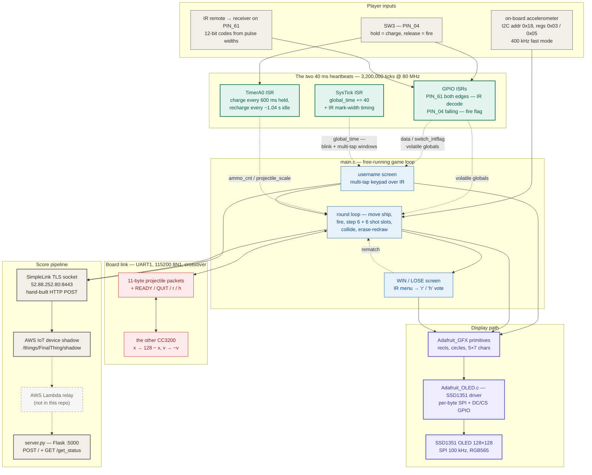
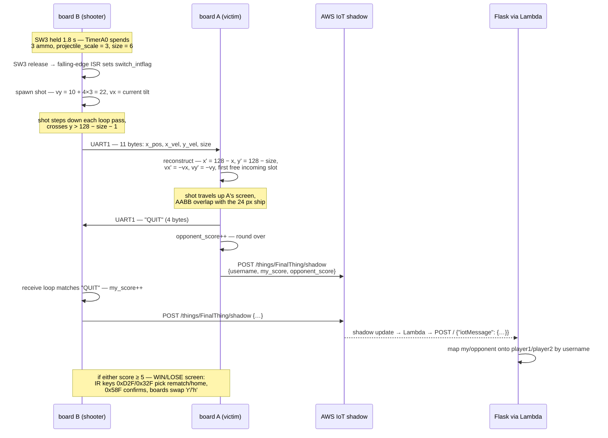

# DUAL — system design

> Two screens, one playfield, folded in half.
>
> Each CC3200 simulates only its own ship, its own six projectile slots, its
> own ammo. Tilt comes in over **I2C** from the on-board accelerometer, frames
> go out over **SPI** to an SSD1351 OLED one byte at a time, and the instant a
> shot crosses the bottom edge it is packed into **11 bytes on UART1**,
> mirrored (`x → 128 − x`, velocities negated), and reborn on the opponent's
> screen travelling the other way. Time lives in two 40 ms interrupts; the
> game loop itself free-runs. A hit becomes the string `QUIT` to the peer and
> a JSON blob to an **AWS IoT device shadow** over raw TLS, which a Lambda
> relays to a **Flask scoreboard**. The two boards never share a clock —
> only events.

This document is the developer-facing map of the whole system — every
component and how data moves between them. The companion [README](README.md)
covers per-subsystem detail, wiring ([docs/wiring-diagram.svg](docs/wiring-diagram.svg)),
building, and flashing.

---

## End-to-end flowchart



**Legend** — ⬜ inputs / cloud endpoints · 🟩 interrupt layer · 🟦 game logic ·
🟪 display path · 🟥 board link · ◌ dashed = external glue not in this repo
(the Lambda; dashed arrows = volatile-global data flow rather than calls).

---

## How to read it: the three ideas that matter

1. **There is no shared game state — only shared events.** Neither board ever
   knows the opponent's ship position, ammo, or velocity. The entire
   multiplayer protocol is four message kinds on UART1: `READY` (both boards
   block until they've swapped it), an 11-byte packet whenever a shot crosses
   the sender's bottom edge, `QUIT` from whichever board's ship was hit, and a
   one-byte `r`/`h` rematch vote. Because a projectile's flight is fully
   determined by its launch state, sending that state once is enough — the
   receiver re-simulates it locally, mirrored. Divergence is impossible to
   *observe* (you never see the opponent's half) and round outcomes are
   authoritative by construction: the victim decides it was hit and tells
   everyone — its peer, and AWS.

2. **Time is two 40 ms interrupts; everything else free-runs.** SysTick and
   TimerA0 are both loaded with 3,200,000 ticks of the 80 MHz clock. SysTick
   owns *measurement*: `global_time` for blink and multi-tap windows, and the
   counter that GPIO edges sample to turn IR marks into microseconds. TimerA0
   owns the *weapon economy*: 15 held ticks (600 ms) spend one ammo into
   charge, 26 idle ticks (~1.04 s) regenerate one. The main loop has no frame
   timer at all — it runs as fast as the SPI bus lets it draw, and all
   ISR-to-loop communication is `volatile` globals (`switch_intflag`, `data`,
   `ammo_cnt`, `projectile_scale`).

3. **The display budget dictates the rendering style.** At 100 kHz SPI with
   per-byte chip-select ceremony, a full-screen clear is 32,768 data bytes —
   whole seconds. So the game never clears mid-round: every moving object
   erases itself by redrawing its old footprint in black, then draws at the
   new position, and `fillRect` leans on the SSD1351's hardware address window
   so a rectangle is one command sequence plus a pixel stream. The visible
   consequence: menus can afford `fillScreen(PINK)` between phases, gameplay
   cannot afford it between frames.

---

## Deep dive 1 — one round, end to end

Board B (BLUE) charges a shot, board A (RED) gets hit — the full journey of
one point, as implemented in [main.c](main.c) and [server.py](server.py):



Worth noticing:

- **The victim is the authority.** Only the board whose ship was hit detects
  the collision; the shooter learns it won the round purely from `QUIT`. There
  is no negotiation and no way to disagree — but also no protection if `QUIT`
  is lost (the shooter would block in its read loop).
- **Both boards report the same round to AWS**, each from its own
  perspective (`my_score` vs `opponent_score`); [server.py](server.py)
  reconciles them by username, so double-reporting is idempotent.
- **The charge economy is asymmetric on purpose**: a fully charged size-12
  shot costs six ammo and flies at `vy = 34`, versus 14 for a quick tap —
  bigger is faster, and the spent ammo takes ~6 s of cooldown to regenerate.

## Deep dive 2 — the packet, and the fold

The entire wire format of the game ([main.c](main.c),
`UART1SendProjectile` / `UART1ReceiveProjectile`):

```text
      11 bytes, big-endian, no start byte / length / checksum
      ┌─────────┬─────────────────┬─────────────────┬────────┐
byte  │  0   1  │  2   3   4   5  │  6   7   8   9  │   10   │
      │  x_pos  │   x_velocity    │   y_velocity    │  size  │
      │ 16-bit  │     32-bit      │     32-bit      │ 8-bit  │
      └─────────┴─────────────────┴─────────────────┴────────┘
        y_position is never transmitted — the receiver derives it

  sender's screen (shots fall)          receiver's screen (shots rise)
  ┌────────────────┐                    ┌────────────────┐
  │   ▣ ship       │                    │        ship ▣  │
  │       ● vy>0   │    x' = 128 − x    │   vy'<0 ●      │
  │       ●        │    y' = 128 − size │         ●      │
  │ ─ ─ ─ ● ─ ─ ─  │ ───── UART1 ─────► │ ─ ─ ─ ─ ● ─ ─  │
  └────────────────┘    vx' = −vx       └────────────────┘
    exits bottom        vy' = −vy         enters bottom,
                                          exits top or hits ship
```

The fold works because a projectile is ballistic: position plus velocity at
the boundary fully determines the rest of its flight, so one packet per
crossing is sufficient — there is no per-frame position streaming. The spawn
row `128 − size` places the shot flush with the receiver's bottom edge, and
the double negation means "down-right" on one screen continues as "up-left"
on the other: with the two LaunchPads laid end to end, the shot appears to
travel in a straight line across both panels. The same receive loop is also
the round-control channel — it string-matches `QUIT` against the partially
filled buffer while collecting the 11 bytes (see the sharp edges for why
that's a gamble).

---

## Component inventory

| Component | Layer | Provenance | Where |
|---|---|---|---|
| Game loop, physics, collision, round/score state | Game | ✅ implemented here | [main.c](main.c) |
| IR pulse decoder + multi-tap keypad (ISRs) | Input | ✅ implemented here | [main.c](main.c) |
| Charge/ammo economy (TimerA0 ISR) | Input | ✅ implemented here | [main.c](main.c) |
| UART1 link protocol (packets, handshakes) | Link | ✅ implemented here | [main.c](main.c) |
| AWS shadow client (`jsonify`, `http_post`, `set_time`) | Cloud | ✅ implemented here (on course TLS helpers) | [main.c](main.c) |
| Flask scoreboard receiver | Cloud | ✅ implemented here | [server.py](server.py) |
| Pin assignments | Board | TI PinMux generated (Jan 2025) | [pin_mux_config.c](pin_mux_config.c) |
| SSD1351 driver port (SPI byte I/O, init, fills) | Display | Adafruit BSD + course port (lab `TODO`s) | [Adafruit_OLED.c](Adafruit_OLED.c) |
| GFX primitives, font | Display | Adafruit BSD, C port | [Adafruit_GFX.c](Adafruit_GFX.c) / [glcdfont.h](glcdfont.h) |
| Polled I2C master helpers | Board | TI SDK (vendored) | [i2c_if.c](i2c_if.c) |
| Linker script, CCS project, debug target | Build | TI SDK / CCS (`i2c_demo` template) | [cc3200v1p32.cmd](cc3200v1p32.cmd), [.project](.project), [targetConfigs/](targetConfigs/) |
| `uart_if` / `gpio_if` / `startup_ccs` | Board | TI SDK, linked by path — not committed | [.project](.project) |
| `simplelink` + `network_utils` (Wi-Fi, TLS) | Cloud | course-provided — not committed | referenced from [main.c](main.c) |
| AWS Lambda relay (shadow → Flask) | Cloud | ⬜ external, not in repo | — |
| Stale build snapshot | — | ⬜ artifact (pre-AWS, Mar 2025) | `Debug/` |

---

## The numbers that matter

| Value | What it is |
|---|---|
| 80 MHz | CC3200 core clock (`SYSCLKFREQ`) |
| 40 ms | SysTick *and* TimerA0 period — 3,200,000 ticks |
| 100 kHz | SPI bit rate to the OLED (`SPI_IF_BIT_RATE`), mode 0, 8-bit words |
| 400 kHz | I2C fast mode to the accelerometer at `0x18` (regs 0x02–0x05) |
| 115200 8N1 | UART1 board link (FIFOs enabled) |
| 128 × 128 | SSD1351 resolution, RGB565 — a full fill is 32,768 data bytes |
| 11 | bytes per projectile packet (x 16-bit, vx/vy 32-bit, size 8-bit) |
| 6 | max ammo = max charge scale = live-shot slots per side (`MAX_PROJECTILES`) |
| 600 ms | one charge step — 15 held TimerA0 ticks spends 1 ammo |
| ~1.04 s | ammo recharge period — 26 idle ticks |
| 10 + 4×scale / 2×scale | projectile y-velocity / pixel size (max 34 / 12) |
| 24 px | ship size; ammo pips are 4 px squares on its flanks |
| ×13⁄64, ×0.99 | tilt→acceleration scaling; per-pass velocity friction |
| > 2000 µs / ≤ 1000 µs | IR start-bit threshold / logic-1 mark width |
| 12 bits | one IR frame (13 edges); codes like `0xD6F` = enter |
| 200 ms / 1500 ms | IR repeat-ignore window / multi-tap letter-cycle window |
| 500 ms / 400 ms | username cursor blink / end-screen highlight blink |
| 5 | round wins to take the game |
| 52.88.252.80:8443 | hardcoded AWS IoT endpoint (TLS); thing `FinalThing` |
| 5000 | Flask scoreboard port (`GET /get_status`) |
| 1 / 0 | `PLAYER_MODE` compile flag — RED / BLUE board identity |

---

## Verification status

There are **no automated tests in this repository** — no unit tests, no
host-side simulation of the link protocol, no CI. The system was validated
the way course hardware projects are: live, on two flashed LaunchPads, by
playing it (see the [demo webpage](https://dihan922.github.io/dual-webpage/)).
The observable checkpoints the code itself provides:

| Checkpoint | Signal |
|---|---|
| Boot + peripherals up | `DisplayBanner("DUAL")` on the UART0 console |
| Wi-Fi / TLS reachable | `connectToAccessPoint` / `tls_connect` return codes; red LED on POST failure |
| Cloud path live | `http_post` echoes the full request and the AWS response to the console |
| Link alive | game only starts after the mutual `READY`; round ends prove packet flow |
| Scoreboard | [server.py](server.py) prints every player/score update; `GET /get_status` for the JSON |

The `Debug/` snapshot shipped alongside the sources (git-ignored, never
committed) is *negative* evidence: the March 2025 binary links an
`oled_test.obj` that no longer exists in the tree and contains no SimpleLink
code, so it predates the AWS integration — the final firmware was built
later and was never captured here.

---

## Design trade-offs & sharp edges

- **Event sync over state sync** — four message kinds instead of lockstep
  simulation. Radically simple and bandwidth-free, but the blocking reads are
  load-bearing: a lost `QUIT` or a dropped packet byte leaves a board spinning
  in `while (index < 11)` forever. There is no timeout anywhere on the link.
- **Positional bytes over framing** — the 11-byte packet has no start byte,
  length, or checksum, and the `QUIT` string-match runs against a partially
  filled packet buffer, so a shot whose first four bytes spell `QUIT`
  (x_pos `0x5155`, x_vel starting `0x4954`) would falsely end the round.
  Astronomically unlikely, structurally possible.
- **Implied y over full state** — the receiver derives the spawn row from
  `size`, saving bytes but welding the protocol to the "shots always cross the
  bottom edge" rule; a future power-up that fires sideways breaks the format.
- **Erase-redraw over framebuffer** — no RAM framebuffer exists; the OLED *is*
  the framebuffer. That makes the 100 kHz SPI the game's true frame clock and
  produces brief trails when sprites overlap, but it keeps RAM free and avoids
  a full-screen blit the bus could never afford.
- **`jsonify` writes up to 256 bytes into 100-byte buffers** — every call
  site pairs `snprintf(output, 256, …)` with `char jsonmsg[100]`. Long
  usernames can corrupt the stack mid-game.
- **`ReadAccData` error path returns −1 as a pointer** — `RET_IF_ERR`
  returns the int `FAILURE` from an `int8_t*` function; an I2C error would
  hand the physics code the address `0xFFFFFFFF` to dereference.
- **The OLED reset never happens** — `Adafruit_Init` pulses GPIOA2 bit `0x2`
  (GPIO17 = PIN_08, muxed here as UART1 RX) instead of the configured PIN_62;
  the panel survives on power-on reset. Inherited scaffolding assumption that
  no longer matches this pinout.
- **Compile-time identity over negotiation** — `PLAYER_MODE` bakes RED/BLUE
  into the binary, so the two boards run *different firmware images*. Zero
  protocol cost, but flashing the same image to both silently breaks the
  color scheme and nothing detects it.
- **Hand-rolled HTTP over MQTT** — the shadow update is a manually
  concatenated `POST` on a raw TLS socket, with the response read once and
  discarded (`acRecvbuff[lRetVal+1] = '\0'` is also off by one). It works, and
  every failure mode is invisible except a red LED.
- **The cloud middle is missing** — the Lambda that turns shadow updates into
  `{"iotMessage": …}` POSTs, and the ngrok tunnel that exposed Flask to it,
  exist only in the original deployment; the repo holds the two endpoints of
  a three-piece pipeline.

---

## Provenance

An embedded-systems course lab final (CCS project `lab-final`), grown from
TI's CC3200 SDK 1.5.0 `i2c_demo` example — [.ccsproject](.ccsproject) records
the template origin, and [.project](.project) still links `uart_if.c`,
`gpio_if.c`, and `startup_ccs.c` straight out of the SDK tree. The
project-authored work is the game itself in [main.c](main.c) (loop, ISRs, IR
decoding, multi-tap keypad, UART1 protocol, AWS shadow client) and
[server.py](server.py); display code is Adafruit's BSD-licensed GFX/SSD1351
library ported to C with course-lab `TODO` scaffolding; board glue
([i2c_if.c](i2c_if.c), linker script, project files) is TI's. Built with
teammate [dihan922](https://github.com/dihan922) — demo and writeup on the
[project webpage](https://dihan922.github.io/dual-webpage/).
